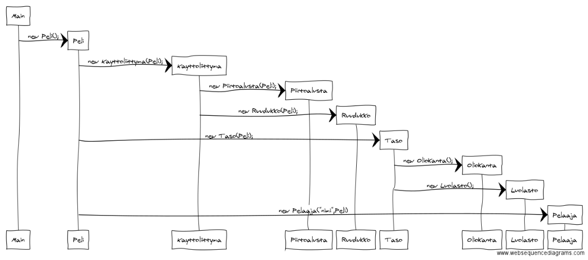
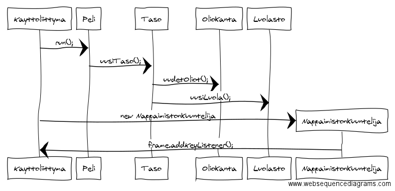

Aihe: Luolatappelu on vuoropohjainen peli, jossa päähahmo on kuvattuna ylhäältä 
päin ja hän koittaa selvitä luolasta tai huoneesta toiseen ja selvitä 
vihollisarmeijoita vastaan. Hahmoa liikutellaan nuolinäppäimin ja 
välilyönnillä hahmolla voi lyödä kasvojen osoittamaan suuntaan. Luolassa 
on yksi tai useampi vihollinen, jotka koittavat pysäyttää päähahmon etenemisen. 
Viholliset liikkuvat joko satunnaisesti tai päähahmoa päin. Taistelu 
lopputulos määrittyy jonkin satunnaisgeneraattorin avulla. Kun päähahmo pääsee 
etenee pelissä viholliset vaikeutuvat. Päähahmolla saattaa olla myös jokin 
kehityskäyrä: pelaaja voi valita osuuko hahmo paremmin, lyökö hän kovempaa 
vai saako hän lisää elämiä.

Kun ohjelman ajaa tulee ruutuun kolme painiketta: Pelaa, ohje ja sammuta. 
Ohjetta klikatessa näkyy käyttäjälle pelinaikaiset toiminnot ja pelin kulku. 
Sammuttaessa ikkuna sulkeutuu ja ohjelma sammuu. Peliä painettaessa peli alkaa 
ja pelaaja voi valita hahmolleen nimen. Pelissä ruutu on jaettu kolmeen osaan. 
Isoimmassa ruudussa näkyy luola / huone, jossa pelaaminen tapahtuu. Sivulla 
kaksi ruutua, jossa toisessa lukee hahmon tiedot ja elämien määrät. Toisessa 
lukee minkälaisia vihollisia huoneessa on. Mahdollisesti käyttöliittymään 
lisätään neljäs ruutu, jossa lukee tapahtumahistoria.

Pelissä on esimerkiksi kymmenen tasoa, jotka kukin toistaan vaikeampia. 
Vihollisten sijainnit lisätään satunnaisesti huoneeseen. Huoneesta pääsee 
eteenpäin kun kaikki viholliset on tuhottu.

Käyttäjät: Pelaaja

Käyttäjän toiminnot: Pelin aloitus, nimen kirjoittaminen ja pelaaminen.

